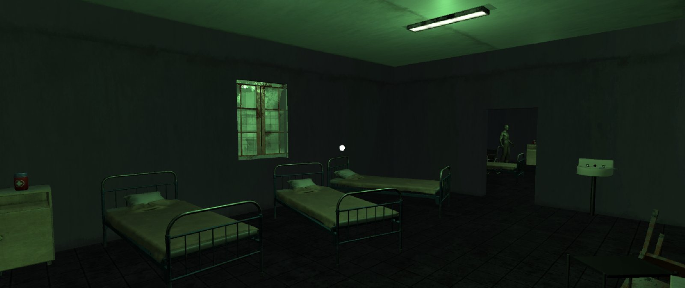
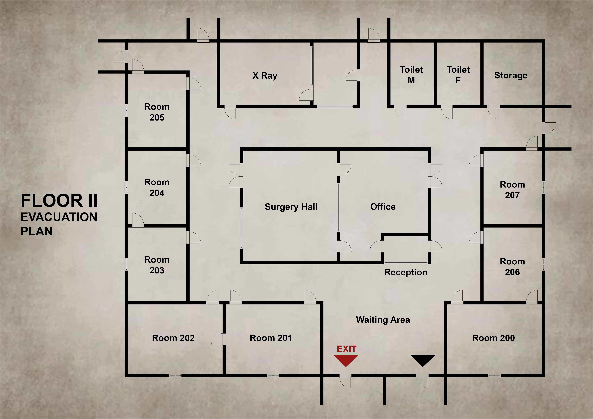

# VR Horror hospital game
A short Virtual reality horror game built in Unity for Google Cardboard.

##  Story 
You explore an **abandoned hospital**, searching for medical supplies to help your injured friend. But beware - other things might be lurking in the dark!

Your goal is simple:  
- **Find enough medical supplies** inside the hospital.  
- **Avoid the lurking dangers** that have emerged from the radiation.
- **Return to your friend** safe and alive.

---

Here is the hospital map to guide your exploration:  

A short demo video can be found here: [demo.mp4](https://drive.google.com/file/d/1JapnQ9p8kwLWOrgYQazgVDx5sbPln1WG/view?usp=drive_link)

## Installation
1. Download the latest APK here: [release](https://drive.google.com/file/d/171PvYIm0QpNWtCXCn21uxqQbX2YjXBC2/view?usp=drive_link)    
2. Open and install it (you may need to allow installations from unknown sources).  
3. Insert your phone into a Google Cardboard (or any Cardboard-compatible VR headset) and enjoy playing the game 🎮 ! 
